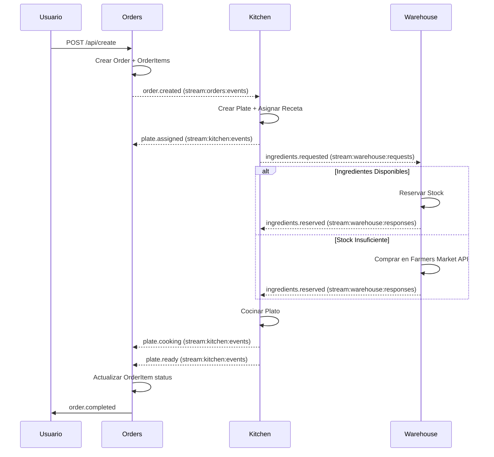

# 🍽️ FreeLunch - Sistema de Gestión de Pedidos

Sistema distribuido basado en arquitectura serverless para automatizar la gestión de pedidos en una jornada de donación masiva de alimentos.

## 📋 Tabla de Contenidos

- [Descripción del Problema](#-descripción-del-problema)
- [Solución Propuesta](#-solución-propuesta)
- [Arquitectura](#-arquitectura)
- [Stack Tecnológico](#-stack-tecnológico)
- [Estructura del Proyecto](#-estructura-del-proyecto)
- [Aplicaciones](#️-aplicaciones)
- [Servicios](#-servicios)
- [Sistema de Eventos](#-sistema-de-eventos)
- [Funcionalidades IA](#-funcionalidades-ia)
- [Demo](#-demo)

## 🎯 Descripción del Problema

Un restaurante necesita automatizar su proceso de preparación de alimentos durante una jornada de donación masiva donde:
- Se sirven platos aleatorios de 6 recetas disponibles
- Cada receta requiere ingredientes específicos
- La bodega tiene inventario limitado (inicia con 5 unidades por ingrediente)
- Cuando faltan ingredientes, se compran automáticamente en la plaza de mercado
- El sistema debe manejar alta concurrencia y ser resiliente

## 💡 Solución Propuesta

Sistema distribuido con arquitectura **serverless event-driven** desplegado en **Vercel** con inteligencia artificial powered by **Google Gemini**:

### Arquitectura Serverless (Vercel)
- **Escalado automático** según demanda sin administrar servidores
- **Edge Functions** para baja latencia global
- **Despliegue continuo** integrado con GitHub
- **Base de datos serverless** con Neon (PostgreSQL) y Upstash (Redis)

### Inteligencia Artificial (Google Gemini)
- **Chat conversacional** para interactuar con el sistema en lenguaje natural
- **Function Calling** para ejecutar acciones: crear órdenes, comprar ingredientes, consultar estado
- **Recomendaciones inteligentes** basadas en inventario y demanda
- **Resolución automática** de alertas de stock bajo

### Capacidades del Sistema
- **Automatiza** todo el flujo desde el pedido hasta la entrega
- **Gestiona inventarios** en tiempo real con alertas proactivas
- **Compra ingredientes** automáticamente cuando es necesario
- **Notifica** el estado de cada pedido mediante eventos

## 🏗️ Arquitectura

### Arquitectura Serverless Distribuida

```
                    ┌──────────────┐
                    │   Frontend   │
                    │   (React)    │
                    └──────┬───────┘
                           │
         ┌─────────────────┼─────────────────┐
         │                 │                 │
         ▼                 ▼                 ▼
┌──────────────┐   ┌──────────────┐   ┌──────────────┐
│   Orders     │   │   Kitchen    │   │  Warehouse   │
│   Service    │   │   Service    │   │   Service    │
└──────────────┘   └──────────────┘   └──────────────┘
         │                 │                 │
         └────────┬────────┴────────┬────────┘
                  │                 │
                  ▼                 ▼
           ┌────────────┐   ┌──────────────┐
           │   Cron     │   │    Market    │
           │ (Workers)  │   │  Integration │
           └────────────┘   └──────────────┘
```

**Nota**: El frontend consume directamente cada servicio. Los workers se ejecutan mediante cron jobs para procesar eventos de forma asíncrona.

### Principios de Diseño

- **Serverless First**: Sin servidores que mantener, escalado automático
- **Event-Driven**: Comunicación asíncrona mediante eventos
- **Microservicios**: Servicios independientes con responsabilidades específicas
- **Resiliente**: Reintentos automáticos y manejo de fallos
- **Observable**: Logs centralizados y trazabilidad de eventos

## 🛠️ Stack Tecnológico

### Backend
- **Runtime**: Node.js 20.x + TypeScript
- **Framework**: Vercel Serverless Functions
- **Base de Datos**: PostgreSQL (Neon)
- **Cache**: Redis (Upstash)
- **Workers**: Vercel Cron Jobs
- **ORM**: Prisma

### Frontend
- **Framework**: React 19 + TypeScript
- **Router**: TanStack Router (file-based routing)
- **Estado**: TanStack Query (server state)
- **Build Tool**: Vite 7
- **Styling**: TailwindCSS 4 + shadcn/ui

### DevOps
- **Monorepo**: Turborepo
- **CI/CD**: GitHub Actions
- **Deploy**: Vercel
- **Monitoring**: Vercel Analytics

### CI/CD - GitHub Actions

El pipeline detecta cambios por servicio y despliega solo lo modificado.

**Secrets (Repository Secrets):**
| Secret | Descripción |
|--------|-------------|
| `VERCEL_TOKEN` | Token de autenticación de Vercel |
| `VERCEL_ORG_ID` | ID de la organización en Vercel |
| `VERCEL_PROJECT_ID_ORDERS` | Project ID del servicio Orders |
| `VERCEL_PROJECT_ID_KITCHEN` | Project ID del servicio Kitchen |
| `VERCEL_PROJECT_ID_WAREHOUSE` | Project ID del servicio Warehouse |
| `VERCEL_PROJECT_ID_DASHBOARD` | Project ID del Dashboard |
| `VERCEL_PROJECT_ID_AI` | Project ID del servicio AI |

**Variables (Repository Variables):**
| Variable | Descripción |
|----------|-------------|
| `ORDERS_DOMAIN_PROD` | Dominio producción Orders |
| `ORDERS_DOMAIN_STAGING` | Dominio staging Orders |
| `KITCHEN_DOMAIN_PROD` | Dominio producción Kitchen |
| `KITCHEN_DOMAIN_STAGING` | Dominio staging Kitchen |
| `WAREHOUSE_DOMAIN_PROD` | Dominio producción Warehouse |
| `WAREHOUSE_DOMAIN_STAGING` | Dominio staging Warehouse |
| `DASHBOARD_DOMAIN_PROD` | Dominio producción Dashboard |
| `DASHBOARD_DOMAIN_STAGING` | Dominio staging Dashboard |
| `AI_DOMAIN_PROD` | Dominio producción AI |
| `AI_DOMAIN_STAGING` | Dominio staging AI |

**Branches y Ambientes:**
- `dev` → Solo CI (lint, test, build)
- `test` → CI + Deploy a Staging
- `main` → CI + Deploy a Producción

### IA (Bonus)
- **Provider**: Google Gemini API
- **SDK**: Vercel AI SDK

## 📁 Estructura del Proyecto

```
freelunch/
├── apps/
│   └── dashboard/                    # Frontend React
│       ├── src/
│       │   ├── components/
│       │   │   ├── layout/           # Sidebar, Layout principal
│       │   │   ├── ui/               # Componentes shadcn/ui
│       │   │   ├── FloatingChat.tsx  # Chat flotante con IA
│       │   │   └── LoginForm.tsx     # Formulario de login
│       │   ├── hooks/                # Custom hooks (useOrders, useChat, etc.)
│       │   ├── lib/                  # Utilidades (auth, utils)
│       │   ├── routes/               # File-based routing (TanStack Router)
│       │   ├── services/             # Clientes API para cada servicio
│       │   └── types/                # Tipos TypeScript
│       └── vercel.json
│
├── services/
│   ├── orders/                       # Servicio de órdenes
│   │   ├── api/
│   │   │   ├── workers/              # Cron consumers
│   │   │   │   └── kitchen-events.ts # Procesa eventos de kitchen
│   │   │   ├── create.ts             # POST /api/create
│   │   │   ├── list.ts               # GET /api/list
│   │   │   ├── status.ts             # GET /api/status
│   │   │   ├── history.ts            # GET /api/history
│   │   │   └── stats.ts              # GET /api/stats
│   │   ├── src/
│   │   │   ├── application/          # Casos de uso (Clean Architecture)
│   │   │   ├── domain/               # Entidades, Value Objects, Eventos
│   │   │   └── infrastructure/       # Adaptadores (Prisma, Redis, etc.)
│   │   ├── prisma/                   # Schema y migraciones
│   │   └── vercel.json
│   │
│   ├── kitchen/                      # Servicio de cocina
│   │   ├── api/
│   │   │   ├── workers/
│   │   │   │   ├── order-consumer.ts     # Procesa órdenes nuevas
│   │   │   │   └── warehouse-consumer.ts # Procesa respuestas de warehouse
│   │   │   ├── recipes.ts            # GET /api/recipes
│   │   │   ├── plates.ts             # GET /api/plates
│   │   │   └── stats.ts              # GET /api/stats
│   │   ├── src/                      # Clean Architecture
│   │   ├── prisma/
│   │   └── vercel.json
│   │
│   ├── warehouse/                    # Servicio de inventario
│   │   ├── api/
│   │   │   ├── workers/
│   │   │   │   └── kitchen-consumer.ts   # Procesa solicitudes de ingredientes
│   │   │   ├── inventory.ts          # GET /api/inventory
│   │   │   ├── purchases.ts          # GET /api/purchases
│   │   │   ├── request-purchase.ts   # POST /api/request-purchase (para IA)
│   │   │   └── stats.ts              # GET /api/stats
│   │   ├── src/                      # Clean Architecture
│   │   ├── prisma/
│   │   └── vercel.json
│   │
│   └── ai/                           # Servicio de IA (Gemini)
│       ├── api/
│       │   ├── chat.ts               # POST /api/chat (conversacional)
│       │   ├── recommendations.ts    # GET /api/recommendations
│       │   └── health.ts             # GET /api/health
│       ├── src/
│       │   ├── clients/              # Clientes para otros servicios
│       │   ├── prompts/              # System prompts para Gemini
│       │   └── tools/                # Function calling definitions
│       └── vercel.json
│
├── docs/
│   ├── GIT_WORKFLOW.md               # Flujo de trabajo Git
│   └── PIPELINE_FLOW.md              # Flujo del pipeline de eventos
│
└── README.md
```

### Patrones de Arquitectura

- **Clean Architecture** en cada servicio (domain → application → infrastructure)
- **File-based Routing** en el frontend con TanStack Router
- **Workers via Cron** para procesamiento asíncrono de eventos
- **Repository Pattern** con Prisma para persistencia
- **Event-Driven** comunicación entre servicios via Redis Streams

## 🖥️ Aplicaciones

| App | Descripción | Documentación |
|-----|-------------|---------------|
| **Dashboard** | Panel de control React para gestionar el sistema | [README](./apps/dashboard/README.md) |

## 🚀 Servicios

| Servicio | Descripción | Documentación |
|----------|-------------|---------------|
| **Orders** | Gestión del ciclo de vida de los pedidos | [README](./services/orders/README.md) |
| **Kitchen** | Selección de recetas y coordinación de preparación | [README](./services/kitchen/README.md) |
| **Warehouse** | Control de inventario y gestión de stock | [README](./services/warehouse/README.md) |
| **AI** | Chat conversacional y recomendaciones con Gemini | [README](./services/ai/README.md) |

## ⚡ Sistema de Eventos

### Flujo de Eventos Principal



### Redis Streams

| Stream | Productor | Consumidor | Propósito |
|--------|-----------|------------|-----------|
| `stream:orders:events` | Orders | Kitchen | Eventos de ciclo de vida de órdenes |
| `stream:kitchen:events` | Kitchen | Orders | Eventos de preparación de platos |
| `stream:warehouse:requests` | Kitchen | Warehouse | Solicitudes de ingredientes |
| `stream:warehouse:responses` | Warehouse | Kitchen | Respuestas de disponibilidad |

### Eventos del Sistema

| Evento | Emisor | Datos | Descripción |
|--------|--------|-------|-------------|
| `order.created` | Orders | orderId, quantity, items[] | Nueva orden creada |
| `order.completed` | Orders | orderId, completedAt | Orden completada |
| `order.failed` | Orders | orderId, reason | Orden fallida |
| `plate.assigned` | Kitchen | plateId, recipeId, ingredients | Receta asignada al plato |
| `ingredients.requested` | Kitchen | plateId, ingredients | Solicitud de ingredientes |
| `plate.cooking` | Kitchen | plateId, cookingStartedAt | Plato en preparación |
| `plate.ready` | Kitchen | plateId, readyAt | Plato listo |
| `plate.failed` | Kitchen | plateId, reason | Plato fallido |
| `ingredients.reserved` | Warehouse | plateId, ingredients | Ingredientes reservados |
| `ingredients.unavailable` | Warehouse | plateId, reason | Ingredientes no disponibles |

## 🤖 Funcionalidades IA

### Sistema de Recomendación Inteligente

El sistema utiliza **Google Gemini** para:

1. **Recomendación de Recetas**
    - Basado en inventario actual
    - Optimización de uso de ingredientes
    - Minimización de desperdicios

2. **Predicción de Demanda**
    - Análisis de patrones históricos
    - Predicción de picos de demanda
    - Sugerencias de pre-compra

3. **Optimización de Compras**
    - Mejor momento para comprar
    - Cantidades óptimas
    - Ahorro de costos

## 🎮 Demo

### Acceso al Sistema
```
PRODUCCION URL: https://freelunch.juliocaicedo.com
STAGING URL: https://freelunch-stg.juliocaicedo.com
Email: cualquier correo @alegra.com (ej: demo@alegra.com)
Verificación: Resolver el reto matemático mostrado
```

## 📧 Contacto

Para preguntas o soporte: llulioscesar@gmail.com / +573233223154

---

**Nota**: Este proyecto demuestra capacidades en arquitectura serverless, event-driven design, y desarrollo full-stack moderno con foco en escalabilidad y mejores prácticas.