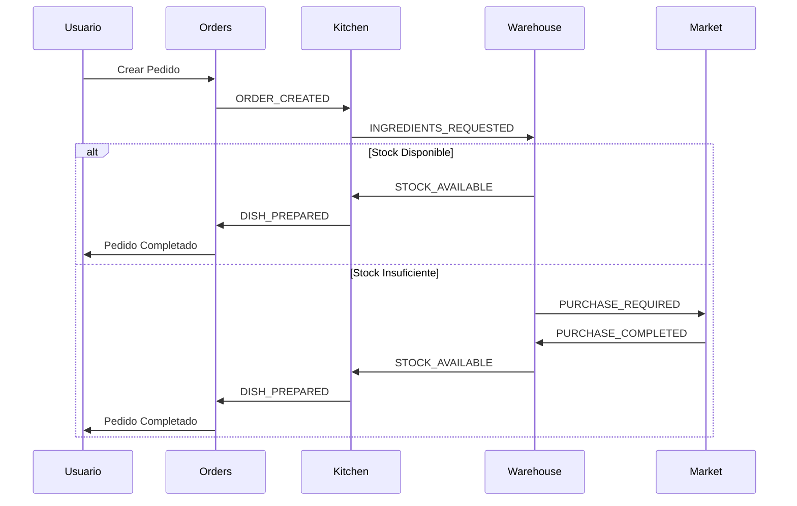

# 🍽️ FreeLunch - Sistema de Gestión de Pedidos

Sistema distribuido basado en arquitectura serverless para automatizar la gestión de pedidos en una jornada de donación masiva de alimentos.

## 📋 Tabla de Contenidos

- [Descripción del Problema](#-descripción-del-problema)
- [Solución Propuesta](#-solución-propuesta)
- [Arquitectura](#-arquitectura)
- [Stack Tecnológico](#-stack-tecnológico)
- [Estructura del Proyecto](#-estructura-del-proyecto)
- [Servicios](#-servicios)
- [Instalación y Configuración](#-instalación-y-configuración)
- [Despliegue](#-despliegue)
- [API Endpoints](#-api-endpoints)
- [Sistema de Eventos](#-sistema-de-eventos)
- [Funcionalidades IA](#-funcionalidades-ia)
- [Demo](#-demo)

## 🎯 Descripción del Problema

Un restaurante necesita automatizar su proceso de preparación de alimentos durante una jornada de donación masiva donde:
- Se sirven platos aleatorios de 6 recetas disponibles
- Cada receta requiere ingredientes específicos
- La bodega tiene inventario limitado (inicia con 5 unidades por ingrediente)
- Cuando faltan ingredientes, se compran automáticamente en la plaza de mercado
- El sistema debe manejar alta concurrencia y ser resiliente

## 💡 Solución Propuesta

Sistema distribuido con arquitectura **serverless event-driven** que:
- **Automatiza** todo el flujo desde el pedido hasta la entrega
- **Escala automáticamente** según la demanda
- **Gestiona inventarios** en tiempo real
- **Compra ingredientes** automáticamente cuando es necesario
- **Notifica** el estado de cada pedido en tiempo real

## 🏗️ Arquitectura

### Arquitectura Serverless Distribuida

```
┌──────────────┐
│   Frontend   │
│   (React)    │
└──────┬───────┘
       │
       ▼
┌──────────────────────────────────────┐
│         API Gateway (Vercel)         │
└──────┬───────────────────────┬───────┘
       │                       │
       ▼                       ▼
┌──────────────┐        ┌──────────────┐
│   Orders     │◄──────►│   Kitchen    │
│   Service    │ Events │   Service    │
└──────────────┘        └──────────────┘
       │                       │
       │    ┌──────────┐      │
       └───►│ QStash   │◄─────┘
            │ (Events) │
            └────┬─────┘
                 │
       ┌─────────┴─────────┐
       ▼                   ▼
┌──────────────┐    ┌──────────────┐
│  Warehouse   │◄──►│    Market    │
│   Service    │    │  Integration │
└──────────────┘    └──────────────┘
```

### Principios de Diseño

- **Serverless First**: Sin servidores que mantener, escalado automático
- **Event-Driven**: Comunicación asíncrona mediante eventos
- **Microservicios**: Servicios independientes con responsabilidades específicas
- **Resiliente**: Reintentos automáticos y manejo de fallos
- **Observable**: Logs centralizados y trazabilidad de eventos

## 🛠️ Stack Tecnológico

### Backend
- **Runtime**: Node.js 20.x + TypeScript
- **Framework**: Vercel Serverless Functions
- **Base de Datos**: PostgreSQL (Neon)
- **Cache**: Redis (Upstash)
- **Mensajería**: QStash (HTTP-based events)
- **ORM**: Prisma

### Frontend
- **Framework**: React 18 + TypeScript
- **Build Tool**: Vite
- **Styling**: TailwindCSS
- **Estado**: Zustand
- **Real-time**: Server-Sent Events / WebSockets

### DevOps
- **Monorepo**: Turborepo
- **CI/CD**: GitHub Actions
- **Deploy**: Vercel
- **Monitoring**: Vercel Analytics

### IA (Bonus)
- **Provider**: Google Gemini API
- **SDK**: Vercel AI SDK

## 📁 Estructura del Proyecto

```
freelunch/
├── services/                   # Microservicios serverless
│   ├── orders/                # Gestión de pedidos
│   │   ├── api/
│   │   │   ├── create.ts     # POST - Crear pedido
│   │   │   ├── list.ts       # GET - Listar pedidos
│   │   │   └── status.ts     # GET - Estado del pedido
│   │   ├── lib/
│   │   ├── package.json
│   │   └── vercel.json
│   │
│   ├── kitchen/               # Lógica de cocina y recetas
│   │   ├── api/
│   │   │   ├── prepare.ts    # POST - Preparar plato
│   │   │   └── recipes.ts    # GET - Obtener recetas
│   │   └── ...
│   │
│   ├── warehouse/             # Gestión de inventario
│   │   ├── api/
│   │   │   ├── inventory.ts  # GET - Estado inventario
│   │   │   └── check.ts      # POST - Verificar disponibilidad
│   │   └── ...
│   │
│   ├── market/                # Integración con plaza de mercado
│   │   ├── api/
│   │   │   └── buy.ts        # POST - Comprar ingredientes
│   │   └── ...
│   │
│   └── ai/                    # Sistema de recomendación IA
│       ├── api/
│       │   └── recommend.ts  # POST - Recomendar recetas
│       └── ...
│
├── frontend/                  # Aplicación web
│   ├── src/
│   │   ├── components/       # Componentes React
│   │   ├── pages/           # Páginas
│   │   ├── hooks/           # Custom hooks
│   │   ├── services/        # API clients
│   │   └── stores/          # Estado global
│   ├── package.json
│   └── vercel.json
│
├── packages/                  # Código compartido
│   ├── shared-types/         # Types TypeScript
│   ├── database/             # Cliente y esquemas DB
│   ├── events/               # Definiciones de eventos
│   └── utils/                # Utilidades comunes
│
├── docs/                      # Documentación
│   ├── architecture.md       # Decisiones arquitectónicas
│   ├── deployment.md         # Guía de despliegue
│   └── api.md               # Documentación API
│
├── .github/
│   └── workflows/           # GitHub Actions
│       ├── ci.yml          # Tests y linting
│       └── deploy.yml      # Deploy automático
│
├── turbo.json               # Configuración Turborepo
├── package.json             # Workspace root
└── README.md               # Este archivo
```

## 🚀 Servicios

### 1. Orders Service
- **Responsabilidad**: Gestión del ciclo de vida de los pedidos
- **Eventos emitidos**: `ORDER_CREATED`, `ORDER_COMPLETED`, `ORDER_FAILED`
- **Escalado**: Automático basado en requests

### 2. Kitchen Service
- **Responsabilidad**: Selección de recetas y coordinación de preparación
- **Eventos emitidos**: `RECIPE_SELECTED`, `INGREDIENTS_REQUESTED`, `DISH_PREPARED`
- **Recetas disponibles**:
    - 🍔 Hamburguesa Clásica
    - 🥗 Ensalada César
    - 🍗 Pollo con Arroz
    - 🥔 Papas Bravas
    - 🍚 Bowl de Arroz
    - 🥪 Sandwich Especial

### 3. Warehouse Service
- **Responsabilidad**: Control de inventario y gestión de stock
- **Eventos emitidos**: `STOCK_AVAILABLE`, `STOCK_INSUFFICIENT`, `PURCHASE_REQUIRED`
- **Inventario inicial**: 5 unidades por ingrediente

### 4. Market Service
- **Responsabilidad**: Integración con API externa de plaza de mercado
- **Eventos emitidos**: `PURCHASE_COMPLETED`, `PURCHASE_FAILED`
- **Endpoint externo**: `https://recruitment.alegra.com/api/farmers-market/buy`

### 5. AI Service (Bonus)
- **Responsabilidad**: Recomendaciones inteligentes basadas en:
    - Inventario disponible
    - Historial de pedidos
    - Predicción de demanda
    - Optimización de compras

## 💾 Instalación y Configuración

### Prerrequisitos
```bash
node >= 20.0.0
npm >= 10.0.0
```

### 1. Clonar el repositorio
```bash
git clone https://github.com/[tu-usuario]/freelunch.git
cd freelunch
```

### 2. Instalar dependencias
```bash
npm install
```

### 3. Configurar variables de entorno
```bash
# Copiar archivo de ejemplo
cp .env.example .env.local

# Configurar las siguientes variables:
DATABASE_URL="postgresql://..."
REDIS_URL="redis://..."
QSTASH_TOKEN="..."
QSTASH_URL="..."
GEMINI_API_KEY="..."
```

### 4. Configurar base de datos
```bash
# Generar cliente Prisma
npm run db:generate

# Ejecutar migraciones
npm run db:migrate

# Seed inicial (opcional)
npm run db:seed
```

### 5. Desarrollo local
```bash
# Iniciar todos los servicios en modo desarrollo
npm run dev

# O iniciar servicios específicos
npm run dev:orders
npm run dev:kitchen
npm run dev:frontend
```

## 🌐 Despliegue

### Despliegue Automático
El proyecto está configurado para despliegue automático en Vercel:

1. Fork este repositorio
2. Conecta tu repositorio con Vercel
3. Configura las variables de entorno en Vercel Dashboard
4. Push a `main` dispara deploy automático

### URLs de Producción
```
Frontend:    https://freelunch.vercel.app
Orders API:  https://freelunch-orders.vercel.app
Kitchen API: https://freelunch-kitchen.vercel.app
Warehouse:   https://freelunch-warehouse.vercel.app
Market:      https://freelunch-market.vercel.app
```

## 📡 API Endpoints

### Orders Service
```http
POST   /api/create       # Crear nuevo pedido
GET    /api/list         # Listar todos los pedidos
GET    /api/status/:id   # Estado de un pedido
```

### Kitchen Service
```http
POST   /api/prepare      # Preparar plato
GET    /api/recipes      # Obtener recetas disponibles
GET    /api/history      # Historial de preparación
```

### Warehouse Service
```http
GET    /api/inventory    # Estado del inventario
POST   /api/check        # Verificar disponibilidad
POST   /api/update       # Actualizar inventario
```

### Market Service
```http
POST   /api/buy          # Comprar ingredientes
GET    /api/purchases    # Historial de compras
```

### AI Service
```http
POST   /api/recommend    # Obtener recomendaciones
GET    /api/analytics    # Analytics y predicciones
```

## ⚡ Sistema de Eventos

### Flujo de Eventos Principal



### Eventos del Sistema

| Evento | Emisor | Datos | Descripción |
|--------|--------|-------|-------------|
| `ORDER_CREATED` | Orders | orderId, quantity | Nuevo pedido creado |
| `RECIPE_SELECTED` | Kitchen | orderId, recipeId | Receta seleccionada |
| `INGREDIENTS_REQUESTED` | Kitchen | orderId, ingredients | Solicitud de ingredientes |
| `STOCK_AVAILABLE` | Warehouse | orderId, ingredients | Stock confirmado |
| `STOCK_INSUFFICIENT` | Warehouse | ingredients, missing | Falta de stock |
| `PURCHASE_REQUIRED` | Warehouse | ingredients, quantity | Compra necesaria |
| `PURCHASE_COMPLETED` | Market | ingredients, purchased | Compra exitosa |
| `DISH_PREPARED` | Kitchen | orderId, dishId | Plato preparado |
| `ORDER_COMPLETED` | Orders | orderId, time | Pedido completado |

## 🤖 Funcionalidades IA

### Sistema de Recomendación Inteligente

El sistema utiliza **Google Gemini** para:

1. **Recomendación de Recetas**
    - Basado en inventario actual
    - Optimización de uso de ingredientes
    - Minimización de desperdicios

2. **Predicción de Demanda**
    - Análisis de patrones históricos
    - Predicción de picos de demanda
    - Sugerencias de pre-compra

3. **Optimización de Compras**
    - Mejor momento para comprar
    - Cantidades óptimas
    - Ahorro de costos

## 🎮 Demo

### Credenciales de Prueba
```
URL: https://freelunch.vercel.app
Usuario: demo@freelunch.com
Password: demo123
```

### Funcionalidades Principales

1. **Dashboard Gerencial**
    - Vista en tiempo real de pedidos
    - Estado del inventario
    - Métricas y estadísticas

2. **Gestión de Pedidos**
    - Crear pedidos masivos
    - Seguimiento en tiempo real
    - Historial completo

3. **Control de Inventario**
    - Vista actual de stock
    - Alertas de bajo inventario
    - Historial de movimientos

4. **Panel de IA**
    - Recomendaciones en tiempo real
    - Predicciones de demanda
    - Insights de optimización

## 📊 Métricas y Monitoreo

- **Uptime**: 99.9% SLA
- **Latencia promedio**: < 200ms
- **Capacidad**: 10,000 pedidos/minuto
- **Escalado**: Automático e ilimitado

## 🧪 Testing

```bash
# Tests unitarios
npm run test

# Tests de integración
npm run test:integration

# Tests E2E
npm run test:e2e

# Coverage
npm run test:coverage
```

## 📝 Licencia

MIT

## 👥 Equipo

Desarrollado para el reto técnico de Alegra

## 📧 Contacto

Para preguntas o soporte: [tu-email]

---

**Nota**: Este proyecto demuestra capacidades en arquitectura serverless, event-driven design, y desarrollo full-stack moderno con foco en escalabilidad y mejores prácticas.