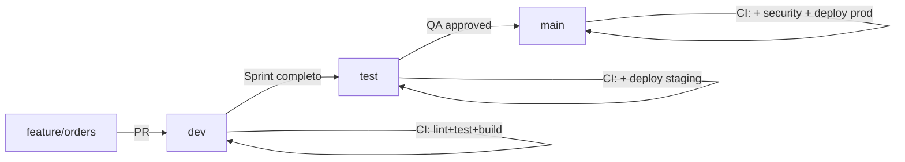

# 🔄 Pipeline Flow - Respuestas a tus Preguntas

## Pregunta 1: ¿Cómo manejar dev → test → main para el reto?

### Respuesta: Usa Git Flow Simplificado

```
┌─────────────────────────────────────────────────────────────────┐
│                      FLUJO COMPLETO                             │
└─────────────────────────────────────────────────────────────────┘

1️⃣  DESARROLLO
    ┌──────────────┐
    │ feature/xxx  │  ← Trabajas aquí
    └──────┬───────┘
           │ PR + CI (lint, test, build)
           ↓
    ┌──────────────┐
    │     dev      │  ← Integración continua
    └──────┬───────┘
           │ Acumula features del sprint
           │ PR cuando sprint completo
           ↓

2️⃣  STAGING/QA
    ┌──────────────┐
    │     test     │  ← Pre-producción
    └──────┬───────┘
           │ Deploy automático a staging
           │ QA manual/automatizado
           │ PR después de validación
           ↓

3️⃣  PRODUCCIÓN
    ┌──────────────┐
    │     main     │  ← Producción
    └──────────────┘
           │ Deploy automático a producción
           │ Tag de versión automático
           ↓
    🎉 En producción!
```

### Workflow Detallado:



## Pregunta 2: ¿Cuándo y dónde ejecutar el pipeline de GitHub?

### Respuesta: En TODOS los PRs, pero con diferente profundidad

### ✅ Pipeline en PR → dev (Más frecuente, más rápido)

**Cuándo:** Cada vez que creas un PR de feature → dev
**Dónde:** GitHub Actions se ejecuta automáticamente
**Qué ejecuta:**
```yaml
✅ Linting (ESLint)           ~10s
✅ Type Check (TypeScript)    ~5s
✅ Unit Tests + Coverage 70%  ~15s
✅ Build                      ~20s
─────────────────────────────────
Total: ~50 segundos
```

**Ejemplo:**
```bash
# Tú haces:
git push origin feature/add-metrics

# GitHub automáticamente:
1. Detecta el push
2. Ejecuta workflow .github/workflows/ci.yml
3. Corre los 4 jobs en paralelo
4. Reporta en el PR si pasa o falla
5. Bloquea merge si algo falla
```

### ✅ Pipeline en PR → test (Antes de staging)

**Cuándo:** Cuando finalizas un sprint y quieres deploy a staging
**Dónde:** GitHub Actions + Deploy a Vercel Staging
**Qué ejecuta:**
```yaml
✅ Todo lo de dev +
✅ Integration tests         ~30s
✅ Build optimizado          ~30s
✅ Deploy a staging          ~40s
✅ Smoke tests en staging    ~20s
─────────────────────────────────
Total: ~2 minutos
```

### ✅ Pipeline en PR → main (Antes de producción)

**Cuándo:** Después de validar en staging, antes de deploy a producción
**Dónde:** GitHub Actions + Deploy a Vercel Production
**Qué ejecuta:**
```yaml
✅ Todo lo de test +
✅ Security scan (Snyk)       ~45s
✅ E2E tests (Playwright)     ~60s
✅ Deploy a producción        ~60s
✅ Create release tag         ~5s
─────────────────────────────────
Total: ~4 minutos
```

## 📊 Matriz de Ejecución Completa

| Evento | Trigger | Pipeline | Deploy | Tiempo | Bloquea Merge |
|--------|---------|----------|--------|--------|---------------|
| `git push feature/xxx` | Push | ❌ No | ❌ | 0s | N/A |
| `PR feature → dev` | PR abierto | ✅ Sí | ❌ | ~50s | ✅ Sí |
| `Merge a dev` | Push a dev | ✅ Sí | ❌ | ~50s | N/A |
| `PR dev → test` | PR abierto | ✅ Sí | ⚠️ Preview | ~2min | ✅ Sí |
| `Merge a test` | Push a test | ✅ Sí | ✅ Staging | ~2min | N/A |
| `PR test → main` | PR abierto | ✅ Sí | ⚠️ Preview | ~4min | ✅ Sí |
| `Merge a main` | Push a main | ✅ Sí | ✅ Production | ~4min | N/A |

## 🎯 Ejemplo Práctico Completo

### Escenario: Implementar Orders Service

```bash
# ════════════════════════════════════════════════════════════════
# DÍA 1: Desarrollo de feature
# ════════════════════════════════════════════════════════════════

# 1. Crear feature desde dev
git checkout dev
git pull origin dev
git checkout -b feature/orders-service

# 2. Trabajar en la feature
# ... código, tests, etc ...

# 3. Commit y push
git add .
git commit -m "feat: implement orders service with hexagonal architecture"
git push origin feature/orders-service

# 4. Crear PR a dev
gh pr create --base dev --title "feat: Orders Service Implementation"

# 5. GitHub Actions EJECUTA AUTOMÁTICAMENTE:
#    ✅ Lint & Type Check      (10s)
#    ✅ Unit Tests (70% cov)    (15s)
#    ✅ Build                   (20s)
#    Total: ~50 segundos

# 6. Si TODO pasa → PR se puede mergear
# 7. Si ALGO falla → PR bloqueado, fix y push de nuevo

# 8. Después de approval → Merge to dev


# ════════════════════════════════════════════════════════════════
# DÍA 5: Final de sprint, deploy a staging
# ════════════════════════════════════════════════════════════════

# 1. Crear PR de dev a test
git checkout test
git pull origin test
gh pr create --base test --head dev --title "Release Sprint 5 to Staging"

# 2. GitHub Actions EJECUTA AUTOMÁTICAMENTE:
#    ✅ Lint & Type Check           (10s)
#    ✅ Unit Tests (70% cov)         (15s)
#    ✅ Build                        (30s)
#    ✅ Deploy to Staging            (40s)
#    ✅ Smoke tests                  (20s)
#    Total: ~2 minutos

# 3. Si TODO pasa → Deploy automático a https://staging.freelunch.com

# 4. QA team valida manualmente en staging

# 5. Si QA aprueba → Merge el PR


# ════════════════════════════════════════════════════════════════
# DÍA 7: Deploy a producción
# ════════════════════════════════════════════════════════════════

# 1. Crear PR de test a main
git checkout main
git pull origin main
gh pr create --base main --head test --title "Production Release v1.2.0"

# 2. GitHub Actions EJECUTA AUTOMÁTICAMENTE:
#    ✅ Lint & Type Check           (10s)
#    ✅ Unit Tests (70% cov)         (15s)
#    ✅ Build                        (30s)
#    ✅ Security Scan                (45s)
#    ✅ E2E Tests                    (60s)
#    ✅ Deploy to Production         (60s)
#    ✅ Create Release Tag           (5s)
#    Total: ~4 minutos

# 3. Si TODO pasa → PR listo para merge

# 4. Requiere 2 approvals (Tech Lead + Product Owner)

# 5. Merge → Deploy automático a https://freelunch.com

# 6. Tag automático: v20241123-150530
```

## 🔍 Cómo Verificar que el Pipeline Funciona

### Paso 1: Ver pipelines en GitHub

```bash
# Opción 1: Web UI
https://github.com/llulioscesar/freelunch/actions

# Opción 2: CLI
gh run list --limit 10

# Opción 3: Ver detalles de un run
gh run view <run-id>
```

### Paso 2: Ver logs en tiempo real

```bash
# Seguir logs del último workflow
gh run watch

# Ver logs de un job específico
gh run view <run-id> --log
```

### Paso 3: Ver status en el PR

Cuando creas un PR, verás checks automáticos:

```
✅ Lint & Type Check — Passed in 10s
✅ Unit Tests & Coverage — Passed in 15s
✅ Build — Passed in 20s

This branch has no conflicts with the base branch
Merging can be performed automatically
```

## 💡 Tips Pro

### 1. Ejecutar pipeline localmente antes del push

```bash
# Simula lo que hará el pipeline
npm run lint
npm run test:coverage
npm run build

# Si todo pasa, entonces push
git push origin feature/xxx
```

### 2. Ver preview de deploy antes de merge

GitHub Actions puede crear "preview deploys":

```yaml
# En el workflow
- name: Deploy Preview
  run: vercel --token=${{ secrets.VERCEL_TOKEN }}
  # URL: https://freelunch-pr-123.vercel.app
```

### 3. Skip pipeline en commits menores

```bash
# Para commits de docs que no necesitan CI
git commit -m "docs: update README [skip ci]"
```

### 4. Re-run failed jobs

```bash
# Desde CLI
gh run rerun <run-id>

# Desde Web UI
# Click en "Re-run failed jobs"
```

## 🚨 Troubleshooting

### Problema: Pipeline falla en PR pero pasa localmente

**Solución:**
```bash
# 1. Limpiar node_modules y reinstalar
rm -rf node_modules package-lock.json
npm install

# 2. Usar misma versión de Node que CI
nvm use 20

# 3. Ejecutar con mismas env vars
NODE_ENV=test npm run test:coverage
```

### Problema: Deploy falla por secretos faltantes

**Solución:**
```bash
# Configurar secretos en GitHub
# Settings → Secrets and variables → Actions → New repository secret

Secretos necesarios:
- VERCEL_TOKEN
- CODECOV_TOKEN (opcional)
- SNYK_TOKEN (opcional)
```

## 📚 Recursos Útiles

- [GitHub Actions Docs](https://docs.github.com/en/actions)
- [Vercel Deploy](https://vercel.com/docs/concepts/deployments/overview)
- [Branch Protection Rules](https://docs.github.com/en/repositories/configuring-branches-and-merges-in-your-repository/managing-protected-branches)
- [CODEOWNERS](https://docs.github.com/en/repositories/managing-your-repositorys-settings-and-features/customizing-your-repository/about-code-owners)

---

## 📋 Checklist Final

Antes de hacer PR:
- [ ] `npm run lint` pasa
- [ ] `npm run test:coverage` pasa con 70%+
- [ ] `npm run build` pasa
- [ ] Commit messages siguen convenciones
- [ ] Branch actualizada con base
- [ ] PR tiene descripción clara
- [ ] Tests agregados para nuevas features
