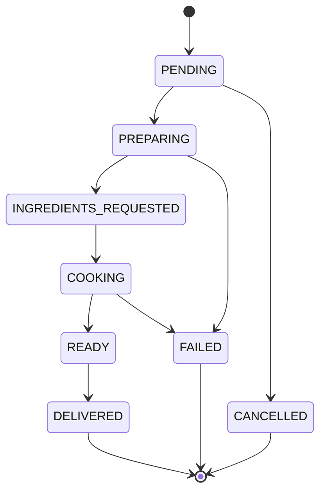

# Orders Service - Hexagonal Architecture

Servicio de gestión de pedidos con Arquitectura Hexagonal y Domain-Driven Design (DDD).

## 🏗️ Arquitectura

Este servicio implementa **Arquitectura Hexagonal** (también conocida como Ports and Adapters) con los principios de **Domain-Driven Design**:

```
src/
├── domain/              # 💎 Núcleo del negocio (sin dependencias)
│   ├── entities/        # Entidades del dominio
│   ├── value-objects/   # Objetos de valor
│   ├── events/          # Eventos de dominio
│   └── repositories/    # Interfaces de repositorios
│
├── application/         # 📋 Casos de uso
│   ├── use-cases/       # Lógica de aplicación
│   ├── dto/             # Data Transfer Objects
│   └── ports/           # Puertos (interfaces)
│
├── infrastructure/      # 🔌 Adaptadores externos
│   ├── adapters/
│   │   ├── persistence/ # Implementaciones de DB
│   │   └── messaging/   # Publicadores de eventos
│   └── config/          # Configuración y DI
│
└── presentation/        # 🌐 Capa de presentación
    └── api/             # Endpoints HTTP
```

## 🎯 Principios de Diseño

### Domain Layer (Centro)
- **Sin dependencias externas**
- Contiene la lógica de negocio pura
- Value Objects inmutables
- Entidades con comportamiento rico
- Eventos de dominio

### Application Layer
- Orquesta casos de uso
- Define puertos (interfaces)
- No contiene lógica de negocio
- Independiente del framework

### Infrastructure Layer
- Implementa los puertos
- Adaptadores para DB, mensajería, etc.
- Detalles técnicos

### Presentation Layer
- Endpoints HTTP
- Validación de entrada
- Transformación de respuestas

## 📋 Descripción

Este microservicio maneja:
- Creación de nuevos pedidos con múltiples platos
- Tracking individual de cada plato (OrderItem)
- Listado y consulta de pedidos con progreso en tiempo real
- Actualización de estado de pedidos basada en eventos
- Comunicación bidireccional con Kitchen Service via eventos

## 🚀 Instalación

```bash
# Instalar dependencias
npm install

# Generar cliente Prisma
npm run db:generate

# Configurar variables de entorno
cp .env.example .env.local
# Editar .env.local con tus valores
```

## 🔧 Desarrollo Local

```bash
# Iniciar en modo desarrollo (puerto 3001)
npm run dev

# Ejecutar migraciones
npm run db:migrate

# Ver base de datos con Prisma Studio
npm run db:studio

# Ejecutar tests
npm test

# Linting
npm run lint
```

## 📡 API Endpoints

### Health Check
```http
GET /api
```

### Crear Pedido
```http
POST /api/create
Content-Type: application/json

{
  "quantity": 5,
  "customerName": "Juan", // opcional
  "notes": "Sin cebolla"   // opcional
}
```

### Listar Pedidos
```http
GET /api/list?page=1&limit=10&status=PENDING
```

### Obtener Estado de Pedido
```http
GET /api/status?id=ORD-123456
```

### Actualizar Estado (interno)
```http
PATCH /api/status?id=ORD-123456
Content-Type: application/json

{
  "status": "READY",
  "completedAt": "2024-01-01T12:00:00Z"
}
```

## 🏭 Value Objects

### OrderId
- Genera IDs únicos con formato: `ORD-{timestamp}-{random}`
- Validación automática del formato

### OrderStatus
- Estados: PENDING, PREPARING, READY, DELIVERED, FAILED, CANCELLED
- Validación de transiciones permitidas
- Lógica de negocio encapsulada

### Quantity
- Rango: 1-100 unidades
- Cálculo de tiempo estimado de preparación
- Detección de procesamiento en lote

### CustomerInfo
- Nombre del cliente (default: "Anonymous")
- Notas especiales opcionales
- Validación de longitud

## 🔄 Eventos

### Eventos que EMITE (Publica)

| Evento | Cuándo | Destino | Datos |
|--------|--------|---------|-------|
| `ORDER_CREATED` | Al crear un pedido | Kitchen Service | orderId, quantity, items[] |
| `ORDER_STATUS_CHANGED` | Al cambiar estado | Analytics | orderId, previousStatus, newStatus |
| `ORDER_COMPLETED` | Cuando todos los platos están listos | Analytics | orderId, completedAt, preparationTime |
| `ORDER_FAILED` | Cuando algún plato falla | Analytics | orderId, reason |

### Eventos que ESCUCHA (Consume)

| Evento | De | Acción | Stream |
|--------|-----|--------|--------|
| `RECIPE_ASSIGNED` | Kitchen Service | Actualiza OrderItem con recipeId | stream:kitchen:responses |
| `DISH_PREPARING` | Kitchen Service | Marca item como PREPARING | stream:kitchen:responses |
| `DISH_PREPARED` | Kitchen Service | Marca item como READY | stream:kitchen:responses |
| `DISH_FAILED` | Kitchen Service | Marca item como FAILED | stream:kitchen:responses |

### Flujo de Eventos

```
Orders Service                Kitchen Service
     │                              │
     ├─ POST /api/create            │
     │  { quantity: 5 }             │
     │                              │
     ├─ Crea 5 OrderItems           │
     │  (status: PENDING)           │
     │                              │
     ├─ Publica ───────────────────>│
     │  ORDER_CREATED               │
     │  { orderId, items[] }        │
     │                              │
     │                        Selecciona receta
     │                              │
     │<──────────────────── Publica │
     │  RECIPE_ASSIGNED             │
     │  { itemId, recipeId }        │
     │                              │
     ├─ Actualiza OrderItem         │
     │  (status: ASSIGNED)          │
     │                              │
     │<──────────────────── Publica │
     │  DISH_PREPARED               │
     │  { itemId }                  │
     │                              │
     ├─ Marca item como READY       │
     │  (progress: 20% → 1/5)       │
     │                              │
     ├─ Auto-completa cuando        │
     │  todos los items listos      │
     │                              │
     ├─ Publica ───────────────────>│
     │  ORDER_COMPLETED             │
     └─ (status: DELIVERED)         │
```

## 🧪 Testing

```bash
# Tests unitarios
npm test

# Test manual con curl
curl -X POST http://localhost:3001/api/create \
  -H "Content-Type: application/json" \
  -d '{"quantity": 2}'
```

## 🔐 Variables de Entorno

```env
DATABASE_URL=              # PostgreSQL connection string
QSTASH_TOKEN=              # Token de autenticación QStash
KITCHEN_SERVICE_URL=       # URL del Kitchen Service
SERVICE_NAME=orders-service
NODE_ENV=development
PORT=3001
```

## 🔄 Consumer Worker

El servicio incluye un consumer worker que procesa eventos de Kitchen Service.

### Opción A: Vercel Cron (Recomendado para Serverless)

Configurar en `vercel.json`:

```json
{
  "crons": [{
    "path": "/api/workers/kitchen-events",
    "schedule": "* * * * *"
  }]
}
```

Esto ejecuta el worker cada minuto para procesar eventos pendientes.

### Opción B: Long-Running Process

```bash
# En desarrollo
npm run worker:kitchen

# En producción (Docker/PM2)
node dist/workers/kitchen-consumer.js
```

### Monitoreo del Consumer

```bash
# Ver mensajes pendientes
curl http://localhost:3001/api/workers/kitchen-events

# Respuesta
{
  "success": true,
  "processed": 5,
  "duration": 234,
  "timestamp": "2025-01-22T10:30:00Z"
}
```

## 📦 Despliegue

```bash
# Generar build
npm run build

# Desplegar a producción
npm run deploy
```

## 🎓 Ventajas de la Arquitectura Hexagonal

1. **Testabilidad**: El dominio se puede testear sin dependencias externas
2. **Flexibilidad**: Cambiar de Prisma a MongoDB? Solo tocas el adaptador
3. **Mantenibilidad**: Separación clara de responsabilidades
4. **Escalabilidad**: Fácil agregar nuevos adaptadores
5. **Domain-Driven**: La lógica de negocio está en el centro

## 📚 Patrones Implementados

- **Repository Pattern**: Abstracción del acceso a datos
- **Use Case Pattern**: Cada caso de uso en su propia clase
- **Value Objects**: Encapsulación de conceptos del dominio
- **Domain Events**: Comunicación desacoplada
- **Dependency Injection**: Inversión de dependencias
- **Ports & Adapters**: Arquitectura hexagonal

## 🚦 Estados del Pedido



El servicio está diseñado para ser mantenible, testeable y escalable siguiendo los mejores principios de arquitectura de software.